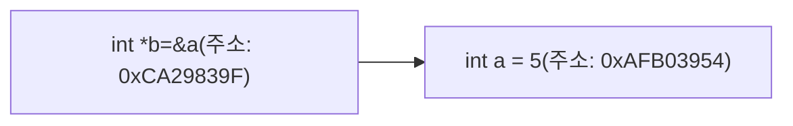

## 1. Hello World 분석

```c
#include<stdio.h>
int main(void) {
    printf("Hello World");
    return 0;
}
```

- 위 코드는 `Hello World`라는 문자열을 출력하는 C언어 소스코드입니다.

### 1-1. `#include<stdio.h>`

- `#include`는 **전처리기 지시문**으로, 프로그램이 컴파일되기 전에 처리됩니다.
- `stdio.h`는 **표준 입출력 라이브러리**로, `printf`와 `scanf` 같은 함수를 사용하기 위해 포함되어야 하는 파일입니다.
- `stdio`는 **Standard Input/Output**의 약자입니다.
- 컴파일러는 `#include<stdio.h>`를 만나면 해당 헤더 파일에 정의된 함수와 매크로를 프로그램에 삽입합니다.

```c
#include<stdio.h>
```

### 1-2. 메인 함수

- C/C++에서는 다양한 함수가 사용될 수 있으나, 프로그램은 항상 메인 함수로부터 시작합니다.
- 함수는 반환값이 없을 수도 있으나, 메인 함수에서는 일반적으로 `0`을 반환하는 것이 관례입니다.

```c
int main(void) {
    return 0;
}
```

### 1-3. 출력 함수 [`printf`]

- C언어는 사용자에게 특정한 문자열을 출력하기 위해 `printf`를 사용합니다.
- `printf`는 `stdio.h` 헤더 파일에 포함되어 있습니다.

```c
printf("Hello World");
```

---

## 2. 변수와 상수

- **변수(Variable)**: 변할 수 있는 데이터입니다.
- **상수(Constant)**: 변하지 않는 데이터입니다.

### 2-1. 변수의 선언

- 변수를 선언할 때 자료형과 변수명을 입력합니다.
- 원하는 경우 초기값을 적용할 수 있습니다.

```c
int a;
int a = 7;
```

### 2-2. 기본 출력

- `stdio.h` 헤더 파일에 선언된 `printf`를 이용하여 정수 데이터를 출력할 수 있습니다.

```c
#include <stdio.h>
int main(void) {
    int a = 7;
    printf("The number is %d.", a);
    return 0;
}
```

### 2-3. 기본적인 자료형

| 자료형      | 설명                                              |
| ----------- | ------------------------------------------------- |
| `int`       | 일반적인 정수형을 표현할 때 사용합니다. (억 단위) |
| `long long` | 긴 정수형을 표현할 때 사용합니다.                 |
| `double`    | 일반적인 실수형을 표현할 때 사용합니다.           |
| `string`    | 문자열을 표현할 때 사용합니다.                    |
| `bool`      | 참/거짓을 표현할 때 사용합니다.                   |
| `char`      | 한 문자를 표현할 때 사용합니다.                   |

### 2-4. 예약어와 식별자

- **식별자**란 변수, 함수 등 고유한 이름을 지정할 때 사용합니다.
- C언어 문법에 의해 정해진 **예약어**는 식별자로 사용할 수 없습니다.

---

## 3. `scanf`

- C언어에서는 사용자로부터 데이터를 입력받을 때 `scanf` 함수를 사용합니다.

```c
#include <stdio.h>
int main(void) {
    int a;
    scanf("%d", &a);
    printf("입력한 숫자는 %d입니다.", a);
    return 0;
}
```

### 3-1. 형식 지정자

| 데이터 타입 | 크기      | 형식 지정자            | 입력 형식 예시         | 출력 형식 예시         |
| ----------- | --------- | ---------------------- | ---------------------- | ---------------------- |
| `long long` | 8 Bytes   | `%lld`                 | `scanf("%lld", &var);` | `printf("%lld", var);` |
| `int`       | 4 Bytes   | `%d`                   | `scanf("%d", &var);`   | `printf("%d", var);`   |
| `double`    | 8 Bytes   | 입력: `%lf` 출력: `%f` | `scanf("%lf", &var);`  | `printf("%f", var);`   |
| `float`     | 4 Bytes   | `%f`                   | `scanf("%f", &var);`   | `printf("%f", var);`   |
| `string`    | 제한 없음 | `%s`                   | `scanf("%s", var);`    | `printf("%s", var);`   |
| `char`      | 1 Byte    | `%c`                   | `scanf(" %c", &var);`  | `printf("%c", var);`   |

- `%` 자체를 문자로 출력하고 싶은 경우, `%%`를 사용하여 출력할 수 있습니다.

```c
#include <stdio.h>

int main() {
    // % 문자를 출력하기 위해 %%를 사용
    printf("This is how you print a percentage sign: %%
");
    return 0;
}
```

## 4. 연산자

### 4-1.연산자와 피연산자

- 연산자(Operator)란 연산을 수항해는 기호를 의미합니다.
- 피연산자(Operand)란 연산에 포함되는 변수나 상수를 의미합니다.
- A+B에서 A와B는 피연산자에 해당하며 +는 연산자에 해당합니다.

  | 피연산자 | +   | 피연산자 |
  | -------- | --- | -------- |
  | A        | +   | B        |

### 4-2.연산자의 종류

- C언어에는 다양한 종류의 연산자가 존재합니다.
- **대입연산자**
  - 등호를 이용해서 우변항을 좌변항에 넣을 수 있습니다.
  - 자료형에 부합하는 값을 좌변항에 있는 변수에 넣습니다.
  ```c
  int a= 100;
  ```
- **산술연산자**

  - c언어에서는 기본적인 사칙연산을 사용할 수 있습니다
  - 나머지 구하기 위해 모듈러(Modular) 연산을 사용한다.

    | 연산자 | 설명   |
    | ------ | ------ |
    | +      | 더하기 |
    | -      | 빼기   |
    | \*     | 곱하기 |
    | /      | 나누기 |
    | %      | 나머지 |

    ```c

    #include <stdio.h>
    int main(void) {
        int a, b;
        scanf("%d %d", &a, &b);
        printf("%d + %d = %d\n", a, b, a + b);
        printf("%d - %d = %d\n", a, b, a - b);
        printf("%d * %d = %d\n", a, b, a * b);
        printf("%d / %d = %d\n", a, b, a / b);
        printf("%d %% %d = %d\n", a, b, a % b);
        return 0;
    }

    ```

- **이스케이프시퀀스**

  - C언어에서 특정한 표현을 출력하기 위해 사용하는 문법입니다.

  | 문자 | 설명           |
  | ---- | -------------- |
  | `\n` | 줄 바꾸기      |
  | `\t` | 수평탭 넣기    |
  | `\\` | 백슬레시넣기   |
  | `\"` | 큰 따옴표 넣기 |
  | `\b` | 백스페이스     |

- **관계연산자**

  | 연산자 | 의미        |
  | ------ | ----------- |
  | `<`    | 작다        |
  | `>`    | 크다        |
  | `==`   | 같다        |
  | `!=`   | 다르다      |
  | `>=`   | 크거나 같다 |
  | `<=`   | 작거나 같다 |

  - 컴퓨터는 0을 거짓(False)로 받아들이며, 그 외의 숫자를 참(True)으로 받아들입니다.
  - 컴퓨터가 거짓(False)을 출력할 때는 0을, 참(True)을 출력할 때는 1을 출력합니다
    ```c
    #include <stdio.h>
    int main(void) {
        int a, b;
        scanf("%d %d", &a, &b);
        printf("%d\n", a > b);
    }
    ```

- **논리연산자**

  | 연산자       | 의미   |
  | ------------ | ------ |
  | !            | 부정   |
  | &&           | 그리거 |
  | &#124;&#124; | 또는   |

- **증감연산자**

  | 연산자     | 설명                                           | 동작                                            |
  | ---------- | ---------------------------------------------- | ----------------------------------------------- |
  | `(변수)++` | 값을 1 증가시킨 후 증가되기 **전**의 값을 반환 | `i`의 원래 값을 반환하고 이후 `(변수)`를 1 증가 |
  | `++(변수)` | 값을 1 증가시킨 후 증가된 **후**의 값을 반환   | `i`를 먼저 1 증가시키고, 증가된 값을 반환       |
  | `(변수)--` | 값을 1 감소시킨 후 감소되기 **전**의 값을 반환 | `i`의 원래 값을 반환하고 이후 `(변수)`를 1 감소 |
  | `--(변수)` | 값을 1 감소시킨 후 감소된 **후**의 값을 반환   | `(변수)`를 먼저 1 감소시키고, 감소된 값을 반환  |

- **삼항연산자**
  - 세 개의 항을 이용해서 조건문을 수행할 수 있는 연산자입니다
    ```c
    #include <stdio.h>
    int main(void) {
        int a = 7, b = 7;
        printf("%d\n", (a == b) ? 100 : -100);
        return 0;
    }
    ```
- **비트연산자**

  | 연산자 | 설명                              | 예제                        | 결과          |
  | ------ | --------------------------------- | --------------------------- | ------------- | ------------ | ------------- |
  | `&`    | 비트 **AND** (그리고)             | `(00001101)2 & (00000011)2` | `(00000001)2` |
  | `~`    | 비트 **NOT** (부정)               | `~(11000011)2`              | `(00111100)2` |
  | `      | `                                 | 비트 **OR** (또는)          | `(11001100)2  | (00110000)2` | `(11111100)2` |
  | `^`    | 비트 **XOR** (배타적 OR)          | `(11001111)2 ^ (00000011)2` | `(11001100)2` |
  | `<<`   | 비트 **Left Shift** (왼쪽 시프트) | `(00001111)2 << 3`          | `(01111000)2` |

### 4-3.연산자 순위

| 우선순위 | 연산자                   | 설명                                     |
| -------- | ------------------------ | ---------------------------------------- |
| 1        | `++`, `--`               | 증감 연산자                              |
| 2        | `!`, `~`                 | 논리 NOT, 비트 NOT                       |
| 3        | `*`, `/`, `%`            | 곱셈, 나눗셈, 나머지 연산                |
| 4        | `+`, `-`                 | 덧셈, 뺄셈                               |
| 5        | `<<`, `>>`               | 비트 왼쪽 시프트, 오른쪽 시프트          |
| 6        | `<`, `<=`, `>`, `>=`     | 비교 연산자 (작다, 작거나 같다, 크다 등) |
| 7        | `==`, `!=`               | 비교 연산자 (같다, 같지 않다)            |
| 8        | 비트 연산자, 논리 연산자 | AND, OR, XOR, 논리 연산                  |
| 9        | 삼항 연산자              | 조건부 연산 (`? :`)                      |

## 5.조건문

- if문 내부의 조건을 검사해 프로그램의 진행 경로를 결정합니다.
- if문은 조건의 개수가 많지 않을때 사용하는 것이 유리합니다.

### 5-1. IF문

```c
if (조건 1) {
// 조건 1에 부합할 때
}
else if (조건2) {
// 조건 1에 부합하지 않지만 조건 2에 부합할 때
}
else {
// 위 조건들에 모두 부합하지 않을 때
}
```

```c
#include<stdio.h>
int main(void) {
    printf("손님이 몇 명 왔나요? ");
    int a;
    scanf("%d", &a);
    if (a == 1 || a == 2) {
    printf("2인석으로 안내합니다.\n");
    }
    else if (a == 3 || a == 4) {
    printf("4인석으로 안내합니다.\n");
    }
    else
    {
    printf("대형석으로 안내합니다.\n");
    }

}
```

### 5-2. Swutch문

- 다양한 조건이 존재할 때 사용하면 소스코드를 짧게 유지할 수 있습니다.

```c
switch (확인 대상) {
case 값1:
// 값 1에 부합할 때
case 값2:
// 값 2에 부합할 때
Default:
// 모든 경우
}
```

- swtich문은 조건에 부합하는 경우 아래쪽의 case도 모두 만족시킵니다.
- 따라서 일반적인 경우 case문의 마지막에 break을 넣어 특정 부분만 실행하도록 컨트롤합니다.

```c
#include<stdio.h>
int main(void){
    printf("학점을 입력하세요. ");
char a;
scanf("%c", &a);
switch (a) {
case 'A':printf("A 학점입니다.\n"); break;
case 'B':printf("B 학점입니다.\n"); break;
case 'C':printf("C 학점입니다.\n"); break;
default:printf("학점을 바르게 입력하세요.\n");
}
}
```

## 6. 반복문

### 6-1.FOR문

- for문 내부의 조건에 부합하면 계속해서 특정 구문을 실행합니다.
- 반복문 탈출을 하고자 하는 위치에 break 구문을 삽입합니다.

```c
for (초기화; 조건; 반복 끝 명령어) {
// 반복적으로 실행할 부분
}
```

### 6-2 for문예제

- 1~100 까지의 정수 출력

```c
#include <stdio.h>
int main(void) {
    for (int i = 0; i <= 100; i++) {
        printf("%d\n", i);
    }

}
```

- 1부터 N까지의 합 출력하기

```c
#include <stdio.h>
int main(void) {
    int n, sum = 0;
    printf("n을 입력하세요. ");
    scanf("%d", &n);
    for (int i = 1; i <= n; i++) {
        sum = sum + i;
    }
    printf("%d\n", sum);
}
```

```c
#include <stdio.h>
int main(void) {
    for (int i = 1; i <= 9; i++) {
        for (int j = 1; j <= 9; j++) {
            printf("%d * %d = %d\n", i, j, i * j);
        }
        printf("\n");
    }
}
```

### 6-3. 무한루프

- 무한 루프(Infinite Loop)란 종료 조건 없이 한없이 반복되는 반복문을 의미합니다.
- 일부러 무한 루프를 발생시키는 경우도 있지만 일반적인 경우 개발자의 실수로 인해 발생합니다.

```c
for (초기화; 조건; 반복 끝 명령어) {
// 조건이 항상 참(True)인 경우 무한 루프 발생
}
```

- **무한루프예제**

  ```c
  #include <stdio.h>
  int main(void) {
  for (;;) {
  // 조건문의 내용이 없으면 항상 참(True)
  printf("Hello World!\n");
  }
  }
  ```

  ```c
  #include <stdio.h>
  int main(void) {
  for (int i = 0; i <= 100; i--) {
    printf("Hello World!\n");
  }
  }
  ```

  #### 6-4.while

- WHILE문의 조건에 부합하면 계속해서 특정한 구문을 실행합니다
- 반복문을 탈출하고자 하는 위치에 break 구문을 삽입합니다.

```c
while (조건) {
// 반복적으로 실행할 부분
}
```

#### 예제코드

```c
#include <stdio.h>
int main(void) {
    int n;
    char a;
    scanf("%d %c", &n, &a);
    while (n--) {
        printf("%c ", a);
    }

    return 0;
}
```

## 7. 함수

- 함수는 입력을 받아서 특정 처리를 하는 구조를 가집니다.
- 특정 기능에 대한 소스코드가 반복되는 것을 줄이도록 도와줍니다.

```c
반환 자료형 함수명(매개변수){
  //수행될 로직
  return 반환값
}
```

- 함수에서는 매개변수와 반환값은 경우에 따라 없을 수 있습니다.
- 반환할 값이 없을때의 자료형은 void 입니다.

### 7-2 함수 예제

- 이름을 출력하는 코드를 함수로 구현

```c

#include<stdio.h>
void hello(name){
  printf("Hello %s",name);
}
int main(void){
  hello("GhostSec");
  return 0;
}
```

- 더하기 함수 만들기

```c
#include <stdio.h>
int add(int a, int b) {
return a + b;
}
int main(void) {
printf("%d\n", add(10, 20));
  return 0;
}
```

- 사칙연산 함수 만들기

```c
#include<stdio.h>
void calculator(int a, int b) {
printf("%d + %d = %d\n",a,b,a +b);
printf("%d- %d = %d\n",a,b,a-b);
printf("%d * %d = %d\n",a,b,a *b);
printf("%d / %d = %d\n",a,b,a /b);
printf("\n");
}
int main(void) {
calculator(10, 3);
calculator(15, 2);
calculator(18, 4);
return 0;
}
```

### 7-3. 재귀함수

- 자기자신을 포함하는 함수
- 기본적으로 자기자신을 계속 불러냅니다.
- 재귀 종료 조건이 필요하다

```c
int factorial(int a) {
  if (a == 1) return 1;
  else return a * factorial(a - 1);
}
int main(void) {
  int n;
  printf("n 팩토리얼을 계산합니다. ");
  scanf("%d", &n);
  printf("%d\n", factorial(n));
  return 0;
}

```

## 8. 배열

- 100개의 숫자가 있을때 가장 큰 숫자를 구하는 프로그램을 작성한다고 가정을 할때 100개의 변수가 기본적으로 필요합니다.
- 이때 100개의 변수를 하나하나 선언을 한다는 것은 비효울적입니다.
- 따라서 동일한 자료형을 여러개를 담는 개념이 필요했고 그것이 바로 **배열** 입니다.

### 8-1. 배열을 사용하는 이유

- 배열을 사용하면 동일한 성격의 데이터를 다수 표현할 수 있습니다.

  | 인덱스 | 0   | 1   | 2   | 3   | 4   | 5   | 6   | 7   | 8   | 9   |
  | ------ | --- | --- | --- | --- | --- | --- | --- | --- | --- | --- |
  | 데이터 | 6   | 5   | 4   | 3   | 9   | 8   | 0   | 1   | 2   | 7   |

### 8-2. 배열의 선언과 초기화

- 배열의 선언은 다음과 같이 할 수 있습니다.

  - **자료형 배열명[배열의 크기] = {초기화 값};**

    - **자료형**: 데이터의 유형을 지정합니다 (예: `int`, `float`, `char` 등).
    - **배열명**: 배열의 이름을 지정합니다.
    - **배열의 크기**: 배열이 저장할 수 있는 요소의 개수를 지정합니다.
    - **초기화 값**: (선택 사항) 배열의 초기값을 중괄호 `{}`로 감싸서 제공할 수 있습니다.
      - 초기화 값을 제공하지 않을 수도 있습니다.

- 다음과 같은 문법으로 배열을 초기화하고 개별적인 값에 접근할 수 있습니다.

```c
#include <stdio.h>
int main(void) {
  int a[10] = { 6, 5, 4, 3, 9, 8, 0, 1, 2, 7 };
  int i;
  for (i = 0; i < 10; i++) {
    printf("%d ", a[i]);
  }
  return 0;
}
```

### 8-3. 문자열과 배열

- 원시적인 C언어는 기본적으로 문자열 자료형을 제공 하지 않습니다.
- 따라서 C언어에서는 문자를 여러개 묶어 놓은 형태로 문자열을 표현합니다.
- C++에서는 이러한 불편함을 알고 있기에 자체적으로 string 자료형을 제공합니다.
- C언어에서는 하나의 문자는 1바이트만 담으므로 다음과 같이 문자의 배열을 사용합니다.

```c
  char a[20]="HELLO WORLD"
```

- 기본적으로 문자열을 선언할 때는 문자열의 크기보다 배열의 크기가 크도록 해야 합니다.
- 문자열을 입력,출력시 %s라는 형식 지정자를 사용합니다

```c
#include <stdio.h>
int main(void) {
  char a[20];
  scanf("%s", &a);
  printf("%s\n", a);
  return 0;
}
```

- c언어는 문자열로 문자의 배열을 쓴다는 점에서 특정 인덱스에 접근이 가능하다는 장점이 있습니다.

```c
#include <stdio.h>
int main(void) {
  char a[20] = "Hello World";
  a[4] = ',';
  printf("%s\n", a);
  return 0;
}
```

## 9. 포인터

- 지금까지의 변수는 그 자체로 자신의 자료형에 맞는 값을 저장합니다.
- 포인터 변수는 기존과 다르게 메모리의 주소를 저장합니다.
- 포인터는 특정한 변수 자체가 존재하는 메모리 주소의 값을 가집니다.
- 아래의 그림을 통해 좀더 쉽게 설명을 하면 기존의 a를 이용하여 값을 찾을 수 있지만 포인터 변수인 b를 이용해서도 5라는 값을 찾을 수 있습니다.



- **int \*b=&a;** 처럼선언할때 쓰는 `*`는 포인터 변수임을 알려주기 위한 목적을 가집니다.
- 이후에 \*b라고 쓰게 되면 이것은 포인터 변수 b가 가리키는 주소의 값을 의미합니다.

### 9-2 C 언어 포인터 관련 연산자

#### 1. 주소 연산자 (`&`)

- **역할**: 변수의 메모리 시작 주소를 구합니다.
- **설명**: 일반 변수 앞에 붙여 해당 변수의 **주소값**을 반환합니다.
- **예제**:
  ```c
  int a = 5;
  int *ptr = &a;  // 변수 a의 주소를 포인터 ptr에 저장
  printf("%p", &a);  // a의 주소 출력
  ```

---

#### 2. 포인터 연산자 (`*`)

- **역할**: 포인터 변수를 선언할 때 사용합니다.
- **설명**: 선언된 포인터 변수가 **메모리 주소를 가리키는 변수**임을 나타냅니다.
- **예제**:
  ```c
  int a = 5;
  int *ptr;  // 포인터 변수 선언
  ptr = &a;  // 포인터에 변수 a의 주소를 저장
  ```

---

#### 3. 간접 참조 연산자 (`*`)

- **역할**: 선언된 포인터 변수가 가리키는 변수의 **값**을 구합니다.
- **설명**: 포인터가 가리키는 메모리 주소를 따라가 해당 위치의 값을 반환합니다.
- **예제**:
  ```c
  int a = 5;
  int *ptr = &a;  // 변수 a의 주소를 포인터 ptr에 저장
  printf("%d", *ptr);  // ptr이 가리키는 변수 a의 값(5)을 출력
  ```

---

| 연산자 | 이름             | 역할                                                            |
| ------ | ---------------- | --------------------------------------------------------------- |
| `&`    | 주소 연산자      | 변수의 메모리 주소를 구합니다.                                  |
| `*`    | 포인터 연산자    | 포인터 변수 선언 시 사용하여 해당 변수가 포인터임을 나타냅니다. |
| `*`    | 간접 참조 연산자 | 포인터가 가리키는 변수의 값을 접근하거나 수정합니다.            |

---

#### 예제 코드

```c
#include <stdio.h>

int main() {
    int a = 5;           // 일반 변수
    int *ptr = &a;       // 포인터 선언 및 주소 할당

    printf("a의 주소: %p\n", &a);    // 주소 연산자 사용
    printf("ptr의 값: %p\n", ptr);  // ptr에 저장된 주소값 출력
    printf("a의 값: %d\n", *ptr);   // 간접 참조 연산자로 a의 값 접근

    return 0;
}
```

### 9-3. 포인터 추가개념

- 실제로 **int a=5;** 와 같이 변수를 할당시 주소상에서는 아래와 같이 기록 됩니다.

  | 355 | 356 | 357 | 358 | 359 | 360 | 361 | 362 | 363 | 364 |
  | --- | --- | --- | --- | --- | --- | --- | --- | --- | --- |
  | ... | ... | 값  | 값  | 값  | 값  | ... | ... | ... | ... |

- **다중포인터**

  - 포인터는 단지 특정한 메모리 주소를 담고 있는 변수일 뿐입니다.
  - 따라서 포인터를 다중으로 사용할 수 있습니다.

    ```c
    #include <stdio.h>
    int main(void) {
      int a = 5;
      int *b = &a;
      int **c = &b;
      printf("%d\n", **c);
      return 0;
    }
    ```

## 10.문자

- C프로그램의 문자는 아스키 코드를 따릅니다.
- 아스키 코드는 0~127중의 1바이트로 구성되며 주요 문자를 출력하도록 해줍니다.
- char형 자체에 숫자를 넣어서 처리를 할수 있습니다.
- 문자 입출력에서 형식 지정자로 %c를 씁니다.
  ```c
  #include <stdio.h>
  int main(void) {
  char a = 65;
  printf("%c\n", a);
  return 0;
  }
  ```

### 10-2. 문자 입출력 함수

- 문자는 getchar()을 이용해 입력을 받는 방식을 이용할 수 있습니다.
- getchar()는 단 하나의 문자를 입력받습니다.

```c
#include <stdio.h>
int main(void) {
  char a = getchar();
  printf("%c\n", a);
  return 0;
}
```

### 10-3. 문자와 버퍼

- 남아있는 입력 버퍼를 항상 지울 수 있습니다.

  ```c
  #include <stdio.h>
  int main() {
    int a; char c;
    scanf("%d", &a);
    printf("%d\n", a);
    int temp;
    // 한 자씩 받아서 파일의 끝이거나 개행 문자를 만나면 입력을 멈추므로 항상 입력 버퍼를 비웁니다.
    while ((temp = getchar()) != EOF && temp != '\n') { }
    scanf("%c", &c);
    printf("%c\n", c);

    return 0;
    }
  ```

### 11. 문자열

- 문자열은 말 그대로 문자들의 배열입니다.
- 문자열은 컴퓨터 메모리 구조상에서 마지막에 NULL을 포함합니다.

  | 0   | 1   | 2   | 3   | 4   | 5   | 6   | 7   | 8   | 9   | 10  | 11     |
  | --- | --- | --- | --- | --- | --- | --- | --- | --- | --- | --- | ------ |
  | H   | E   | L   | L   | O   |     | W   | O   | R   | L   | D   | **\0** |

- NULL값은 문자열의 끝을 알리는 목적으로 사용이 되며 printf함수를 사용하여 문자열을 출력하면 내부적으로 NULL을 만날때 까지 출력을 하게 됩니다.

#### 11-2. 문자열과 포인터

- 문자열 형태로 포인터를 사용하면 포인터의 특정한 문자열의 주소를 넣게 됩니다.
- 아래의 코드는 **HELLO WORLD** 문자열을 읽기 전용으로 메모리 공간에 넣은뒤 그 위치를 처리합니다.

```c
#include 니다. <stdio.h>
int main(void) {
  char *a = "Hello World";
  printf("%s\n", a);
  return 0;
}
```

- 이러한 문자열을 ‘문자열 리터럴’이라고 말합니다. 이는 컴파일러가 알아서 메모리 주소를 결정합니다.
- 포인터로 문자열을 선언 했다고 하더라도 기존의 배열처럼 사용할 수 있습니다.

```c
#include <stdio.h>
int main(void) {
  char *a = "Hello World";
  printf("%c\n", a[1]);
  printf("%c\n", a[4]);
  printf("%c\n", a[8]);
  return 0;
}
```

#### 11-3. 문자열 입출력 함수

- 문자열 입출력을 수행합니다.
- scanf 함수는 공백을 만날때까지 입력을 받지만 gets()함수는 공백까지 포함하여 한 줄을 입력받습니다.

```c
#include <stdio.h>
int main(void) {
  char a[100];
  gets(a);
  printf("%s\n", a);
  return 0;
}
```

#### 11-4.문자열 처리를 위한 다양한 함수

- C언어에서는 문자열 함수는 **<string.h>** 라이브러리에 포함되어 있습니다.

| 함수       | 설명                                                                    |
| ---------- | ----------------------------------------------------------------------- |
| `strlen()` | 문자열의 길이를 반환합니다.                                             |
| `strcmp()` | 문자열 1이 문자열 2보다 사전적으로 앞에 있으면 -1, 뒤에 있으면 1을 반환 |
| `strcpy()` | 문자열을 복사합니다.                                                    |
| `strcat()` | 문자열 1에 문자열 2를 더합니다.                                         |
| `strstr()` | 문자열 1에 문자열 2가 어떻게 포함되어 있는지를 반환합니다.              |

```c
#include <stdio.h>
#include <string.h>

int main() {
    // 1. strlen() 예제
    char str1[] = "Hello, World!";
    printf("'%s'의 길이: %zu\n", str1, strlen(str1));

    // 2. strcmp() 예제
    char str2[] = "Apple";
    char str3[] = "Banana";
    int result = strcmp(str2, str3);
    if (result < 0) {
        printf("'%s'은(는) '%s'보다 사전적으로 앞에 있습니다.\n", str2, str3);
    } else if (result > 0) {
        printf("'%s'은(는) '%s'보다 사전적으로 뒤에 있습니다.\n", str2, str3);
    } else {
        printf("'%s'와(과) '%s'은(는) 같습니다.\n", str2, str3);
    }

    // 3. strcpy() 예제
    char source[] = "Copy this!";
    char destination[20];
    strcpy(destination, source);
    printf("복사된 문자열: %s\n", destination);

    // 4. strcat() 예제
    char greeting[20] = "Hello, ";
    char name[] = "Alice";
    strcat(greeting, name);
    printf("결합된 문자열: %s\n", greeting);

    // 5. strstr() 예제
    char text[] = "Find the needle in the haystack.";
    char keyword[] = "needle";
    char *found = strstr(text, keyword);
    if (found) {
        printf("'%s'에서 '%s'를 찾았습니다: %s\n", text, keyword, found);
    } else {
        printf("'%s'에서 '%s'를 찾을 수 없습니다.\n", text, keyword);
    }

    return 0;
}

```

### 12. 컴퓨터가 변수를 처리하는 방법

- 컴퓨터에서 프로그램이 실행되기 위해서는 프로그램이 메모리에 적재(Load)되어야 합니다.
- 당연히 프로그램의 크기를 충당할수 있을 만큼의 메모리 공간이 있어야 합니다.
- 일반적인 컴퓨터 운영체제는 메모리 공간을 네가지로 구분하여 관리 합니다
  |코드영역|데이터영역|힙영역|스택영역|
  |-------|---------|-----|--------|
  |소스코드|전역변수,정적변수|동적할당변수|지역변수 매개변수|

#### 12-2 전역변수

- 전역변수(Global Variable)란 어디서든 접근 가능한 변수를 말 합니다.
- main함수가 실행되기도 전에 프로그램 시작과 동시에 메모리에 할당됩니다.
- 프로그램의 크기가 커질 수록 전역변수로 인해 프로그램이 복잡해질수 있습니다.
- 메모리의 데이터(Data)영역에 적재 됩니다.

```c
#include <stdio.h>
int a = 5;
int changeValue() {
  a = 10;
}
int main(void) {
  printf("%d\n", a);
  changeValue();
  printf("%d\n", a);
  return 0;
}
```

#### 12-2 지역변수

- 지역변수(Local Variable)란 프로그램에서 특정한 블록(Block)에서만 접근할 수 있는 변수를 말합
  니다.
- 함수가 실행될 때마다 메모리에 할당되어 함수가 종료되면 메모리에서 해제됩니다.
- 메모리의 스택(Stack) 영역에 기록됩니다.
  ```c
  #include <stdio.h>
  int main(void) {
    int a = 7;
    if (1) {
      int a = 5;
    }
  printf("%d", a);
  return 0;
  }
  ```

#### 12-3.정적변수

- 정적 변수(Static Variable)란 특정한 블록에서만 접근할 수 있는 변수입니다
- 프로그램이 실행될 때 메모리에 할당되어 프로그램이 종료되면 메모리에서 해제됩니다.
- 메모리의 데이터(Data) 영역에 적재됩니다.
  ```c
  #include <stdio.h>
  void process() {
    static int a = 5;
    a = a + 1;
    printf("%d\n", a);
  }
  int main(void) {
    process();
    process();
    process();
    return 0;
  }
  ```

#### 12-4.레지스터 변수

- 레지스터 변수(Register Variable)란 메인 메모리 대신 CPU의 레지스터를 사용하는 변수입니다.
- 레지스터는 매우 한정되어 있으므로 실제로 레지스터에서 처리될 지는 장담할 수 없습니다.

  ```c
  #include <stdio.h>
  int main(void) {
    register int a = 10, i;
    for (i = 0; i < a; i++) {
      printf("%d ", i);
    }

    return 0;
  }
  ```

  #### 12-5. 함수의 매개변수가 처리될 때

  - 함수를 호출할 때 함수에 필요한 데이터를 매개변수로 전달합니다.
  - 전달 방식은 **값에 의한 전달** 방식과 **참조에 의한 전달** 방식이 있습니다.
  - **값에 의한 전달방식**
    - 단지 값을 전달하므로 함수내에서 변수가 새롭게 생성됩니다.
    - 따라서 원래 변수의 값에 영향을 미치지 못합니다.
    ```c
    include <stdio.h>
    void add(int a, int b) {
    a = a + b;
    }
    int main(void) {
      int a = 7;
      add(a, 10);
      printf("%d\n", a);
      return 0;
    }
    ```
  - **참조에 의한 전달 방식**

    - 참조에 의한 전달 방식은 주소를 전달하므로 원래의 변수 자체에 접근할 수 있습니다
    - 이러한 방식을 이용하면 원래 변수의 값에 접근하여 값을 변경할 수 있습니다

      ```c
      #include <stdio.h>
      void add(int *a) {
        *a = (*a) + 10;
      }
      int main(void) {
        int a = 7;
        add(&a);
        printf("%d\n", a);
        return 0;
      }

      ```

## 13. 다차원 배열 포인터배열

- **2차원배열의 필요성**
  - 2차원 배열은 굉장히 많은 목적으로 사용됩니다
  - 행렬 데이터를 표현할때, 그래프 알고리즈을 처리할 때 다수의 실생활 데이터를 처리할때 사용됩니다.
  - 흔이 우리가 보는 표 구조가 2차원 배열과 흡사합니다.
    | 이름 | 영어 성적 | 수학 성적 | 국어 성적 |
    |--------|-----------|-----------|-----------|
    | 홍길동 | 85 | 97 | 79 |
    | 유관순 | 100 | 89 | 98 |
    | 이순신 | 99 | 77 | 99 |
    | 장보고 | 89 | 70 | 78 |
    | 신립 | 95 | 98 | 98 |
- **2차원 배열 초기화**

  - 2차원 배열은 1차원 배열이 중첩되었다는 의미로 [](대괄호)를 두번 연속하여 씁니다.
  - **자료형 배열이름[행][열] = { {값, 값, 값, …}, {값, 값, 값, …}, … }**

  ```c
  int a[10][10];
  ```

  - 2차원 배열 또한 기본적으로 0인덱스부터 시작합니다.
  - 2차원 배열은 2중 for문과 함께 많이 사용됩니다.

  ```c
  #include<stdio.h>
  int main(void){
    int arr[3][3]={{1,2,3},{4,5,6},{7,8,9}};
    for(int i=0; i<3;i++){
      for(int j=0;j<3;j++){
        printf("%d ",arr[i][j]);
      }
      printf("\n");
    }
    return 0;
  }
  ```

  - 2차원 배열 이상의 다차원 배열또한 사용될 수 있습니다.
  - 우리 컴퓨터는 기본적으로 화면에 2차원 형태만 출력할 수 있습니다.

  ```c
  #include<stdio.h>
  int main(void){
      int arr[2][3][3]={{{1,2,3},{4,5,6},{7,8,9}},{{1,2,3},{4,5,6},{7,8,9}}};
      for(int i=0; i<2;i++){
          for(int j=0; j<3; j++){
              for(int k=0;k<3;k++){
                  printf("%d ",arr[i][j][k]);
              }
              printf("\n");
          }
          printf("\n");
      }
      return 0;
  }
  ```

### 13-2. 포인터 배열

- 포인터를 배열처럼 사용을 할 수 있습니다.

  ```c
  #include <stdio.h>
  int main(void) {
    int a[5] = { 1, 2, 3, 4, 5 };
    int *b = a;
    printf("%d\n", b[2]);

    return 0;
  }
  ```

- 배열의 이름은 배열의 첫 번쨰 주소라는 것을 기억합니다.
  ```c
  #include <stdio.h>
  int main(void) {
    int a[5] = { 1, 2, 3, 4, 5 };
    int *b = &a[0];
    printf("%d\n", b[2]);
    return 0;
  }
  ```
- 포인터 연산을 통해 자료형의 크기만큼 이동합니다.
- 따라서 int형 포인터는 4바이트씩 이동합니다.

  ```c
  #include <stdio.h>
  int main(void) {
    int a[5] = { 1, 2, 3, 4, 5 };
    int i;
    for (i = 0; i < 5; i++) {
      printf("%d ", a + i);
    }

    return 0;
  }
  ```

- 배열을 포인터 처럼 사용해 각 원소에 접근이 가능합니다
  ```c
  #include<stdio.h>
  int main(void){
    int arr[5]={0,1,2,3,4};
    for (int i=0;i<5;i++){
      printf("%d ",*(arr+i));
    }
    return 0;
  }
  ```
- 2차원 배열또한 포인터로 처리 할수 있습니다.

```c
#include <stdio.h>
 int main(void) {
   int a[2][5] = { { 1, 2, 3, 4, 5 },
   { 6, 7, 8, 9, 10 } };
   int (*p)[5] = a[1];
   int i;
   for (i = 0; i < 5; i++) {
     printf("%d ", p[0][i]);
   }
   return 0;
 }
```
